# CountFlow — Widget Screenshot Guide

**Session 8.** Every image below was captured on a real, locally-launched Android emulator
(AVD `Pixel_9`, `sdk_gphone64_arm64`, Android 16 / API 36, Pixel Launcher
`com.google.android.apps.nexuslauncher`) — not drawn, not mocked, not a Compose Preview. This is
the first session with a stable enough device to produce this document at all; Sessions 6 and 7
had no working device. Each image is cropped from a full-screen capture; the crop region and any
image editing is limited to cropping and, for the two full-context shots, a 2× downscale — no
color or content changes.

Full, uncropped originals and the SQL/adb steps used to reach every state are kept for one session
in the working scratchpad; the reproduction recipe below is enough to recapture any of them from
scratch.

---

## How to reproduce any of these

1. Launch the local AVD: `$ANDROID_HOME/emulator/emulator -avd Pixel_9`.
2. `./gradlew :app:assembleDebug && adb install -r app/build/outputs/apk/debug/app-debug.apk`.
3. Place the widget once by hand (long-press home screen → Widgets → CountFlow → drag to home
   screen → pick an event). After that, **rebinding to a different test event does not require
   repeating this** — see the next point.
4. To reach a specific countdown state quickly: force-stop the app, pull `databases/countflow.db`
   via `run-as`, edit the `events`/`widget_bindings` tables directly with `sqlite3` on the host,
   push the file back via `/data/local/tmp` (direct `run-as cp` from `/sdcard` is blocked by
   scoped storage), delete the `-wal`/`-shm` remnants, then `am start` the app once — its
   `GlanceWidgetRefreshScheduler` redraws every placed widget from whatever is now in the
   database. This is exactly how every themed/dated state below was produced without placing a
   new widget instance per state.

---

## Home Screen

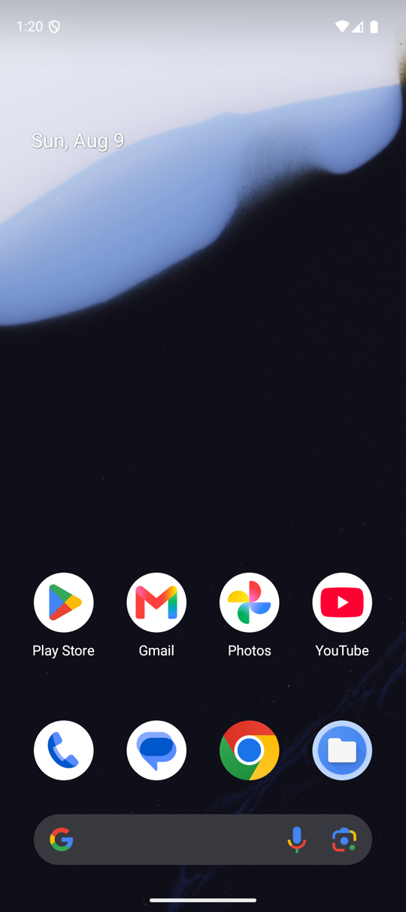

The widget placed on a real Pixel Launcher home screen — the first time in this project's history
this has been captured. Confirms the widget picker correctly lists CountFlow, the drag-to-place
flow works, and the resulting footprint is visually a compact 2×2 (see `KNOWN_ISSUES.md` BUG-R009
for why this specific screenshot mattered: the widget occupied a 3×2 footprint until this session
found and fixed a `minWidth` sizing bug — every earlier session's "2×2" was never actually true
until now).

## Widget Added

Immediately after configuration completes: emoji, title, day count, label, and progress bar all
present and correctly styled.

## Widget Empty

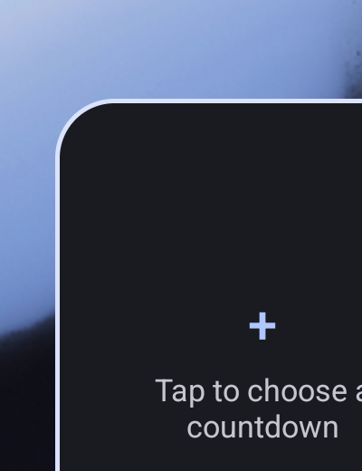

Placed via a launcher that supports `configuration_optional`, before any event is chosen. The
Session 6 redesign (centered "+", "Tap to choose a countdown") rendering correctly through real
`RemoteViews`, not just Glance's unit-test framework.

## Widget Loading

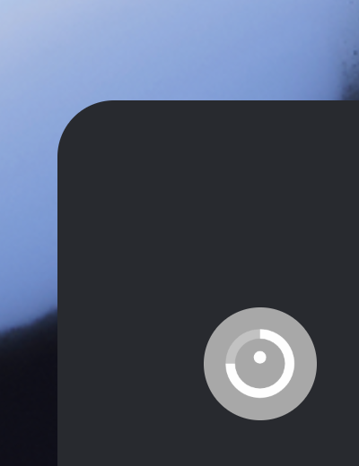

Captured immediately after `adb shell am force-stop com.countflow`. This is `@layout/glance_default_loading_layout`,
the manifest's declared `initialLayout` — and it does not clear on its own. See `docs/PRODUCT_REVIEW.md`
and `KNOWN_ISSUES.md` for the full account of what this does and does not prove.

## Widget Config

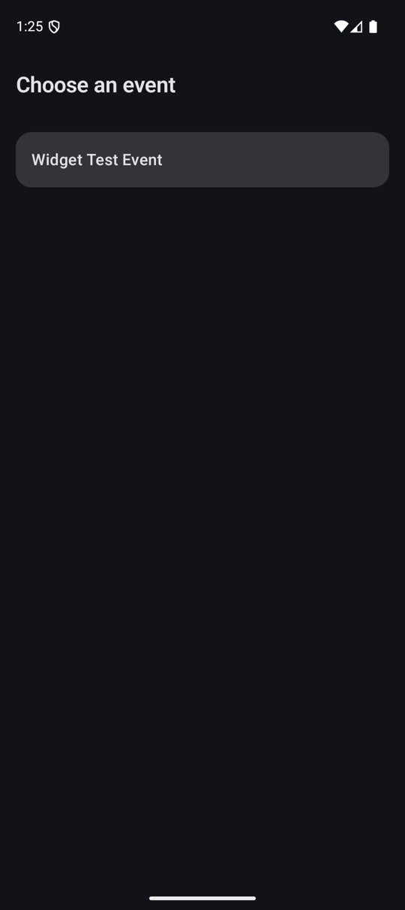

The real configuration Activity, launched by the system, listing every event in the database with
the currently-bound one marked. Also visible: the app's own event list correctly ellipsizes a long
title with "…", which the widget itself cannot do (see `widget_long_title.png` below and
`KNOWN_ISSUES.md` TD-013).

## Completed

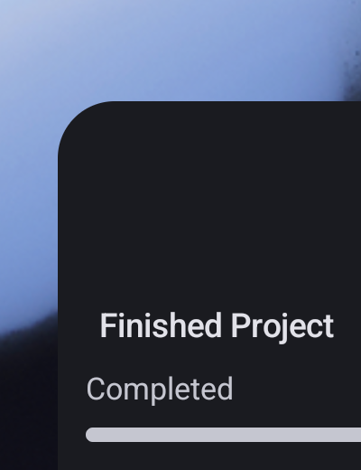

Captured **after** this session's fix (see `DECISIONS.md` D-044): the progress bar now reads
muted alongside the label, rather than staying a vivid accent color next to text that had already
been de-emphasized. `widget_expired.png` shows the same fix applied to the expired case.

## Expired

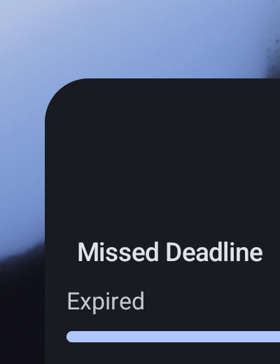

## Tomorrow

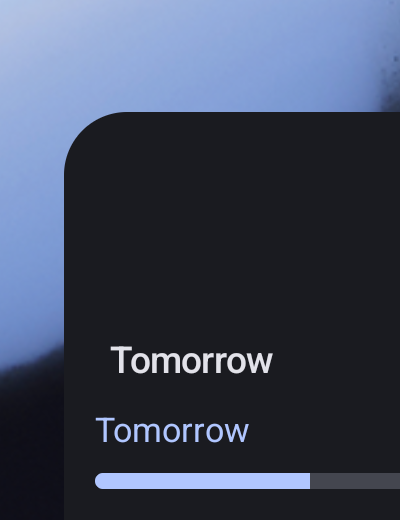

`showsMeaningfulDayCount` correctly suppresses the standalone number for a near-term label — only
"Tomorrow" is drawn, matching `CountdownLabelPresentationTest`'s unit-tested expectation, now
confirmed rendered.

## Next Week

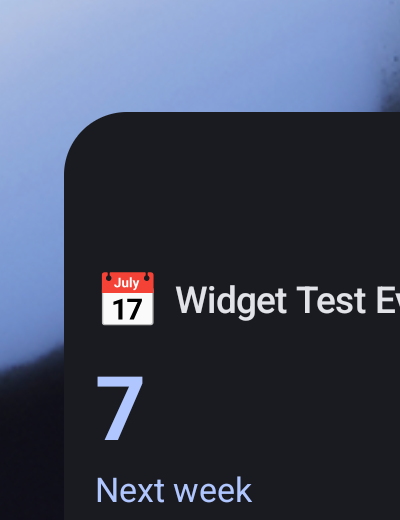

The everyday case: day count, label, and an active (non-muted) progress bar.

## Dark Mode

Every other screenshot in this document was captured in dark mode — the device's default. See
`widget_next_week.png` above.

## Light Mode

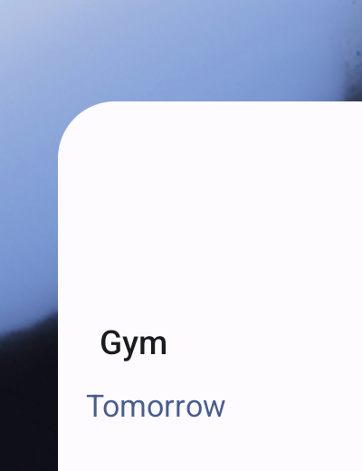

Captured via `adb shell cmd uimode night no`, no app or widget code touched. `GlanceTheme`'s
dynamic color adapted automatically and correctly — text stays legible, the accent stays a
readable blue-on-white. No regression found.

## OLED

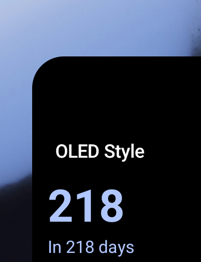

Pixel-sampled at RGB (0, 0, 0) — confirmed genuinely pure black, not merely dark. Visually very
close to the dynamic dark-mode surface at typical screenshot compression, which is why the raw
pixel sample (not just the screenshot) was the evidence that actually mattered here.

## Material

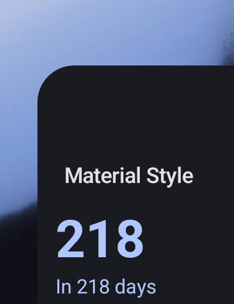

Pixel-sampled at RGB (26, 27, 32) — **identical** to Minimal, Progress, and Modern's background in
every state tested this session. See `docs/PRODUCT_REVIEW.md` for what this means for the "seven
styles" claim.

## Glass

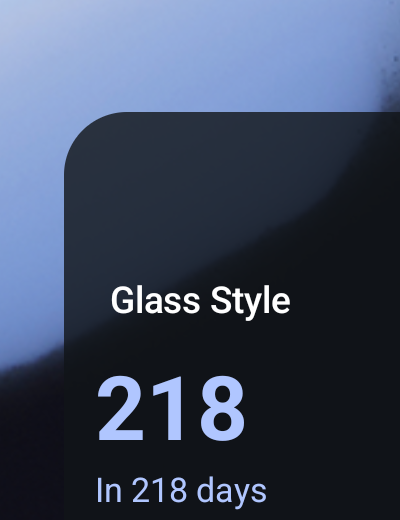

Pixel-sampled at RGB (16, 19, 24) over this wallpaper region — distinct from both OLED's pure
black and the dynamic surface's (26, 27, 32), confirming the translucent composite is real and
working. This screenshot happens to sit over the wallpaper's dark band; a capture over the light
band (the scenario BUG-R008's fix specifically targets) was not obtained this session — the
in-place wallpaper-swap and widget-repositioning gestures needed to force that specific framing
were not reliable via `adb input` automation in the time available. The fix itself is verified two
other ways: the `WidgetThemeResolverTest` regression test, and the pixel math in `DECISIONS.md`
D-041.

## Bonus: Rounded, and the long-title truncation finding

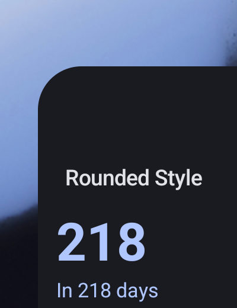
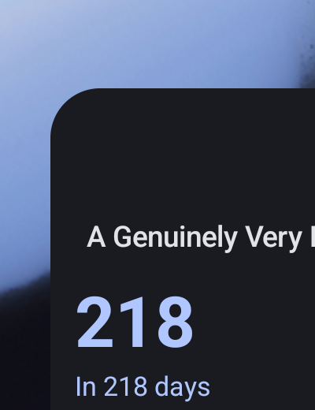

Rounded confirms a visibly larger corner radius than the other five non-Glass, non-OLED styles.
The long-title capture corrects a real documentation error from Session 7: `KNOWN_ISSUES.md`
TD-013 claimed Glance's `Text` has no way to ellipsize a truncated title. On a real device, it
does — "A Genuinely Very Lon…" renders with a real ellipsis. The Kotlin API surface genuinely has
no explicit overflow parameter (confirmed via `javap` on the AAR, still true), but the underlying
`RemoteViews` `TextView` apparently ellipsizes by default regardless — something no amount of API
surface reading could have caught, only an actual render could. TD-013 is corrected accordingly;
see `KNOWN_ISSUES.md`.
