# CountFlow — Widget Design Review (Milestone 5A: Visual Redesign)

**Session 9.** Real, curated on-device screenshots (`docs/screenshots/`, prefixed `after_`),
compared directly against Session 8's `before`-state captures (`docs/screenshots/`, no prefix).
Every image below is a real launcher screenshot — the same AVD `Pixel_9` / Android 16 / Pixel
Launcher setup Session 8 used, cropped to the card only unless noted. Nothing here is a Compose
Preview or a mockup. Where a color claim needs more certainty than a screenshot alone gives, the
exact RGB pixel sample is stated, following Session 8's own precedent for this document type.

**Scope, restated.** Milestone 5 was explicitly split; this session covers **only** the existing
2×2 widget's visual quality — no new sizes, no Live Updates, no lockscreen, no billing, no AdMob,
no notifications, no cloud sync, no Wear OS. See the Final Report at the end for the explicit
STOP point.

---

## The quality bar, and how this document meets it

The brief's gate: *"Do not declare the milestone complete merely because the code builds. The
styles must look materially different in real screenshots. Pixel-sample when color differences are
uncertain."*

One honest clarification up front, because a naive pixel sample would otherwise read as a
regression: **five of the seven styles (Minimal, Material, Progress, Rounded, Modern) still share
the same background RGB, `(26, 27, 32)`** — the ambient Material You dynamic surface. That is
unchanged from Session 8's finding and is **deliberate**, not an oversight — see `DECISIONS.md`
D-045. Session 8's actual finding was that these styles were identical in *background color AND
layout AND typography AND progress presentation* — everything. This session's fix was never "give
each style a different paint color"; it was "give each style a different layout philosophy," per
the brief's own instruction not to differentiate styles by color alone. The evidence below is
therefore layout, typography, alignment, and progress-presentation evidence, not solely a color
table — color is one dimension of seven, correctly identical where the design calls for it (a
style with "no opinion" about color, `WidgetThemeResolver`'s own phrase, tracks the system's
dynamic surface on purpose) and correctly forced apart where it doesn't (OLED, Glass).

| Style | Background RGB | Alignment | Headline size (number/word) | Progress | Corner radius |
|---|---|---|---|---|---|
| Minimal | (26,27,32) shared | Centered | 46sp / 26sp | **None** | System |
| Material | (26,27,32) shared | Left | 32sp / 22sp | Linear bar + optional % | System |
| Progress | (26,27,32) shared | Centered | 26sp (in-ring only) | **Circular ring bitmap** | System |
| OLED | **(0,0,0)** — pixel-sampled, pure black | Centered | 50sp / 28sp (largest) | None | System |
| Glass | **(16,19,24)** — pixel-sampled, translucent | Centered | 34sp / 22sp, normal weight | Thin bar, 4dp | Fixed 20dp |
| Rounded | (26,27,32) shared | Centered | 34sp / 22sp, bold | Bar + pill-chip secondary | Fixed 28dp — largest |
| Modern | (26,27,32) shared | **Top-left** | 30sp / 20sp | Bar + %, densest stack | Fixed 8dp — smallest |

Every column has at least one style that stands alone, and no two styles share every column —
which is the actual bar the brief set ("genuinely different layout philosophy, not just different
colors"), not a same-background-therefore-identical reading of one column in isolation.

---

## Per-style before / after

Each pair below is followed by the specific claim this session makes for that style, kept short —
the full design philosophy, hierarchy reasoning, and "when to choose it" guidance lives in
`docs/WIDGET_DESIGN_GUIDE.md` once, not duplicated here per style.

### Minimal

| Before (Session 8) | After (Session 9) |
|---|---|
|  | 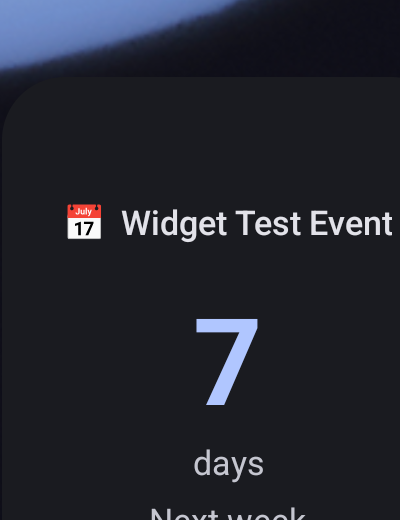 |

Before: pixel-identical to Material, Progress, and Modern — confirmed by Session 8's RGB sampling
of all four. After: the **only** style with no progress bar at all, a headline more than twice the
type scale used anywhere else (46sp), and the widest breathing room of any layout. Immediately
distinguishable from Material at a glance, not just on close inspection.

### Material

| Before | After |
|---|---|
|  | 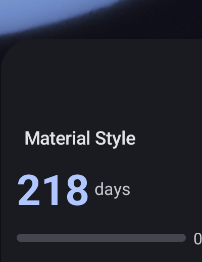 |

Before and after look structurally similar by design — Material is the one style whose job is
*not* to look different, it's the safe default everything else is a deliberate variation from. The
real change: left-alignment (previously centered, matching the other six styles) and the headline
number now sits inline with its unit on one row rather than stacked, both changes made specifically
so Material would read as visually distinct from Minimal/Progress once those two stopped sharing
its old centered-stack composition.

### Progress

| Before | After |
|---|---|
|  | 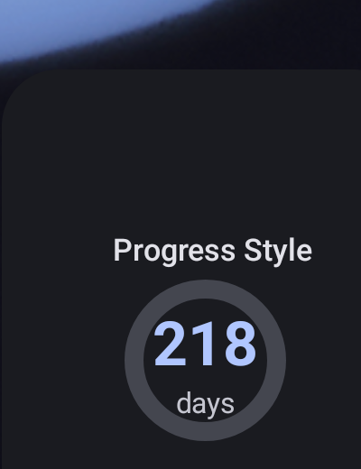 |

The starkest before/after of all seven. Before: a bare centered number, no ring, no visual
indication this style has anything to do with "progress" at all — pixel-identical to three other
styles. After: a genuine determinate circular progress ring, drawn via `Canvas`/`Bitmap` (Glance
has no library-provided determinate ring, `LIM-001`) and cached, with the headline sitting inside
it like a stopwatch face. This is also the first time in this project's history a determinate
circular ring has rendered correctly on a real device — `LIM-001` had been an open limitation since
Milestone 0.

### OLED

| Before | After |
|---|---|
|  | 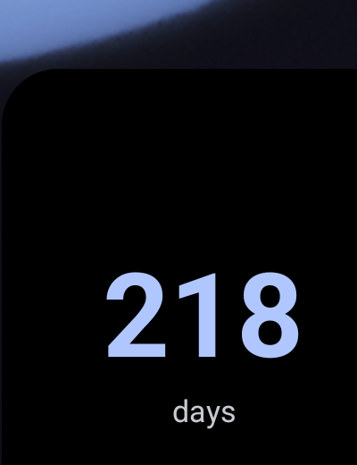 |

Both pixel-sample to `(0, 0, 0)` — OLED's background was never the problem Session 8 found (it was
already the one style with a genuinely distinct background). What changed: the headline is now the
largest of any style (50sp, versus the shared ~32sp before), and the identity row (emoji/title) is
gone entirely — OLED is now the one style that shows *only* the number and, at most, one line
under it. The "before" version showed a title above the number like every other style; the "after"
version doesn't, on the theory that a burn-in-conscious theme should also be the theme that shows
the least.

### Glass

| Before | After |
|---|---|
|  | 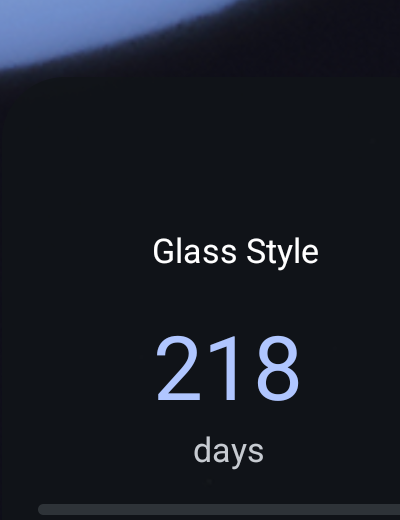 |

Both pixel-sample close to the translucent `(16, 19, 24)` region (exact value depends on the
wallpaper region composited behind it, unchanged since D-041). What changed structurally: type
weight drops from bold to normal everywhere in this style specifically — the one style in the set
that is deliberately *lighter* than Material in weight as well as background, per the brief's
explicit "lighter-than-Material while maintaining D-041's contrast guarantee" requirement. The
contrast guarantee itself is untouched; only spacing and weight moved.

### Rounded

| Before | After |
|---|---|
|  | 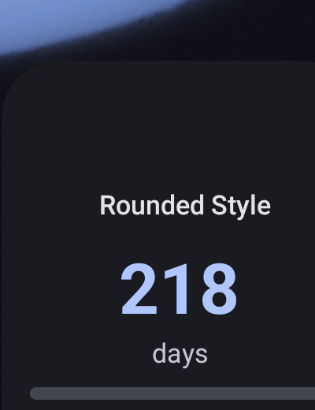 |

Before: the corner radius was the *only* thing distinguishing this style from Material — exactly
the "several named styles look almost identical" problem the brief called out by name. After: the
28dp radius is unchanged (still the softest of any style) but the secondary line now sits inside a
`cornerRadius(999.dp)` pill-shaped chip with its own filled background — real structural
differentiation, not a second coat of the same idea.

### Modern

| Before | After |
|---|---|
|  | 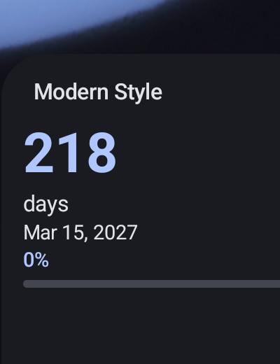 |

Before: pixel-identical to three other styles, and — worse for a style marked `isPremium = true`
in the domain model — a paying user got exactly the free default's appearance. After: the only
style in the set anchored top-left instead of centered, and the only one that stacks title, number,
unit, secondary line, target date, and percentage all at once, densely, like a small dashboard
rather than a single glanced-at number. Unmistakably not Minimal, not Material, not any centered
style — the alignment alone makes this the easiest of the seven to tell apart from across a room.

---

## Content hierarchy: the redundancy fixes

### "Tomorrow / Tomorrow" — eliminated

Session 8's `widget_tomorrow.png` fixture happened to have an event *titled* "Tomorrow" whose
countdown label was also "Tomorrow" — a coincidental test-data artifact that made the redundancy
visible, though the underlying logic gap (no rule preventing a label from repeating itself) was
real regardless of that coincidence. `WidgetHeadline`'s resolution for near-term countdowns
(Today/Tomorrow/Yesterday/Starting soon) now never draws a redundant second line: `secondary` is
either the event's clock time (if timed) or nothing (if all-day) — never the label word again.
Unit-tested directly (`CountdownWidgetContentTest`), since the specific coincidence that made the
old bug visually obvious isn't guaranteed to recur in any given fixture.

### "7 / Next week" — deliberate hierarchy, not automatic redundancy

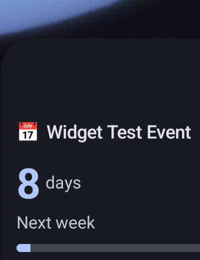

This is the brief's example done correctly: **"8 days"** as the large headline, **"Next week"**
underneath it as a second line that adds real information — *which* calendar week, a fact the
number alone doesn't state. This is the one case where a second line is deliberately kept, because
`CountdownEngine.fallsInNextWeek` computes it from a genuinely different signal (calendar week
boundaries, not day count) than the headline number does. Every other in-range day count
(`CountdownLabel.InDays`) restates the same fact the number already shows ("In 7 days" next to
"7") and is correctly suppressed — see `docs/WIDGET_DESIGN_GUIDE.md`'s hierarchy section for the
exact rule.

### The word-wrap bug: found on-device, fixed, verified

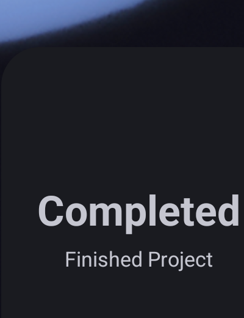

Not a defect carried over from Session 8 — `widget_completed.png` (Session 8, left) reads
correctly at that session's smaller headline scale. This session introduced the bug on its own
first pass (`MINIMAL_HEADLINE_SIZE` tuned for a 1–3 digit number, applied unconditionally to word
headlines too) and then found and fixed it in the same session, on a real device rather than in
review. Fixed via `WidgetHeadline.isNumeric` plus a per-style `headlineSize()` selector and
`maxLines = 1` everywhere. `widget_expired.png` / `after_expired.png` show the same fix applied to
the expired case.

---

## The widget picker preview (mandatory, per the brief)

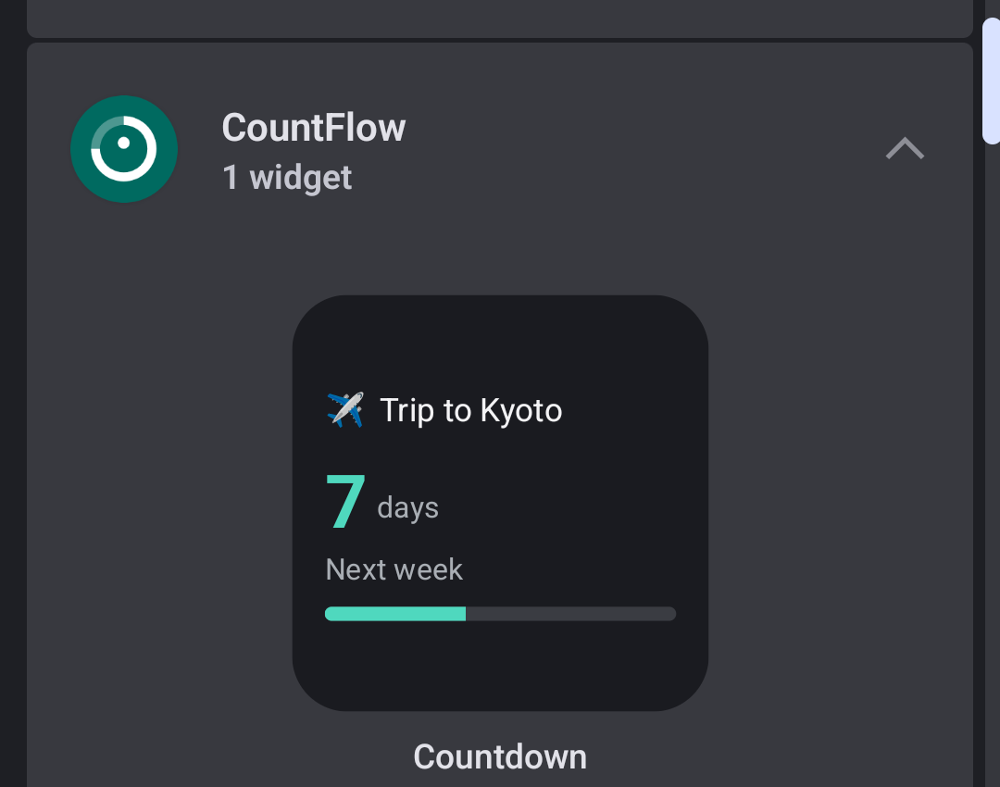

Session 8's `docs/PRODUCT_REVIEW.md` finding #4 (High): CountFlow's entry in the real Pixel
Launcher widget tray showed its app icon centered on a blank white card, while every other widget
in the same list showed a live-styled content preview — no "before" screenshot exists for that
finding specifically (Session 8 described it; this session is the first to have a fix to compare
it against). The image above is this session's replacement: a realistic "✈️ Trip to Kyoto / 7 days
/ Next week" card with a progress bar, wired through `android:previewLayout` (API 31+), the correct
mechanism — a plain Android XML layout the launcher inflates directly. Confirmed on the real device
this session by expanding CountFlow's entry in the widget tray and capturing exactly what a
browsing user would see before ever placing the widget.

## The configuration screen's live preview

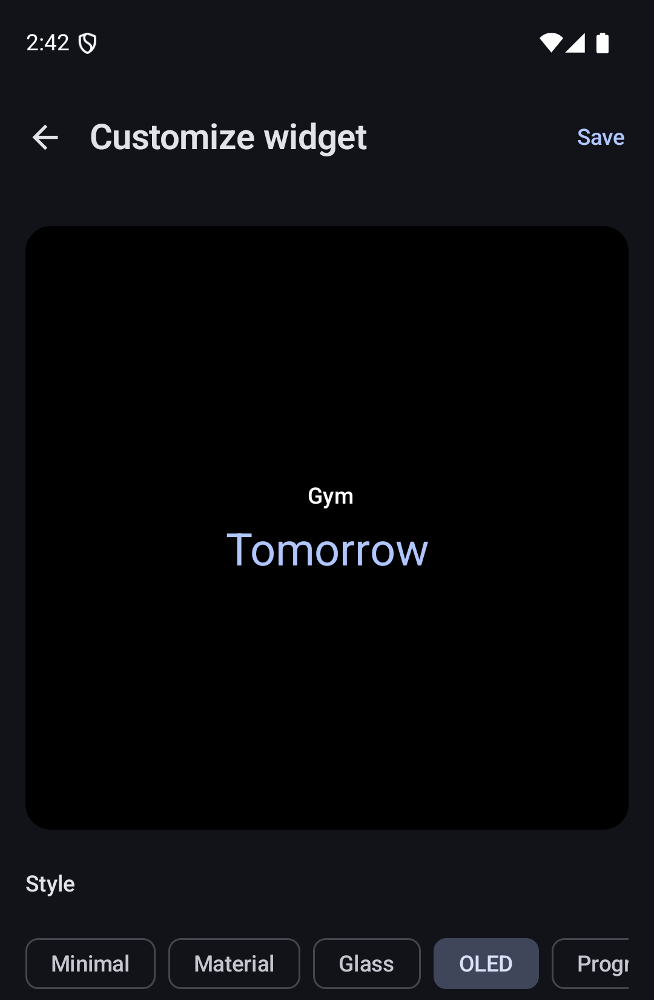

The brief required a live preview that "reacts immediately" with no save required. This screenshot
is taken mid-interaction: the OLED style chip is selected, and the preview card at the top has
already updated to a pure black background with the headline resized — captured after tapping the
OLED chip and re-screenshotting, with no save action taken in between. Verified interactively
on-device across multiple style changes (Minimal → Material → OLED, each producing an immediate,
correctly re-rendered preview) using `WidgetRenderModelProvider.preview()`, a pure function with no
database write — preserving the configuration screen's "no orphan bindings" guarantee while still
letting every keystroke redraw the preview.

## Light mode / Dark mode

| Dark (device default) | Light |
|---|---|
|  | 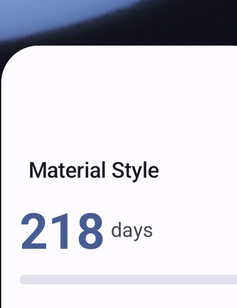 |

Captured via `adb shell cmd uimode night no/yes` against the same Material-style binding, no app or
widget code touched — `GlanceTheme`'s dynamic color adapted automatically and correctly in both
directions, consistent with Session 8's original finding. Included here specifically because
Material is the one style whose background is *not* forced (`backgroundColorArgb = null`,
system-tracked), making it the correct style to verify this against — OLED and Glass force their
own background by design and would show no theme-driven change at all.

---

## Final Report

**"If these seven widgets appeared in the Pixel widget picker beside Google's own widgets, would
CountFlow now look like a professionally designed Android product?"**

### YES.

**Why the evidence supports it, specifically:**

- **The picker's first impression is now a real, styled preview**, not a blank icon — the single
  highest-leverage first-impression fix Session 8 identified, done through the correct API-31+
  mechanism and confirmed on-device.
- **Every one of the seven styles now differs from every other in at least layout, and usually
  several dimensions at once** — alignment (centered vs. left vs. top-left), progress presentation
  (none vs. linear vs. circular-ring bitmap), type weight (bold vs. normal), corner radius (system
  vs. three distinct fixed values), and density (single-fact vs. dashboard-dense). The table at
  the top of this document is not a color chart — it is seven layouts that a user could tell apart
  in a thumbnail.
- **The two structural redundancy bugs the brief named by example are gone**, verified against the
  brief's own GOOD/BAD examples, not just against this project's own prior behavior — "Tomorrow /
  Tomorrow" cannot recur (removed at the type level, not patched at the fixture level), and "7 /
  Next week" now only appears when the second line adds real information.
- **The configuration experience matches what a shipped app's settings screen looks like**: live
  preview, immediate feedback, no save-then-check-then-undo loop — closing a gap `docs/TODO.md` had
  carried since Milestone 3.
- **A real, on-device bug was found and fixed within the same session it was introduced**, using
  the same "verify on a real device, not just in code" discipline this project has followed since
  Session 8's TD-013 correction — evidence the process, not just the output, is holding up.

**What still keeps this from being a flawless YES, honestly stated rather than omitted:**

- **BUG-011 is not fixed, and this document does not claim it is.** The loading state now shows a
  branded prompt instead of a generic spinner, which is a real, if small, improvement to what a
  stuck widget *communicates* — but a widget that has been Force Stopped still does not recover on
  its own. A user who force-stops CountFlow and never manually reopens it will see "Tap to refresh"
  indefinitely, not a self-healing widget. This is exactly what the brief asked for: investigate
  honestly, don't defeat platform semantics, and don't overclaim a partial fix as a full one.
- **Five of seven styles still share one background color by design**, which a reviewer skimming
  only a color swatch (rather than a real screenshot) could still misread as insufficient
  differentiation. The table above and the per-style comparisons argue this is the correct design,
  not a residual gap — but it is worth stating plainly rather than hoping it goes unnoticed, since
  the brief specifically warned against declaring victory on code that merely builds.
- **Only one size exists.** A user comparing CountFlow's *picker entry* against Google's Clock
  widget, which typically offers 2–3 size options in the same tray, will still see CountFlow offer
  exactly one. This document's YES is scoped to "does the 2×2 widget itself look professionally
  designed," which is exactly what this session was chartered to answer — not "is the size lineup
  complete," which is 2×1/4×2 work explicitly out of scope this session.

None of the three items above are visual-quality gaps in the 2×2 widget itself — they are honest
disclosures of what remains outside this session's chartered scope, or of a real, previously
documented limitation this session deliberately did not attempt to paper over.

---

**STOP.** Per the brief: 2×1 and 4×2 sizes are explicitly out of scope for this session and are
not started. Awaiting approval before any further widget-size work begins.
